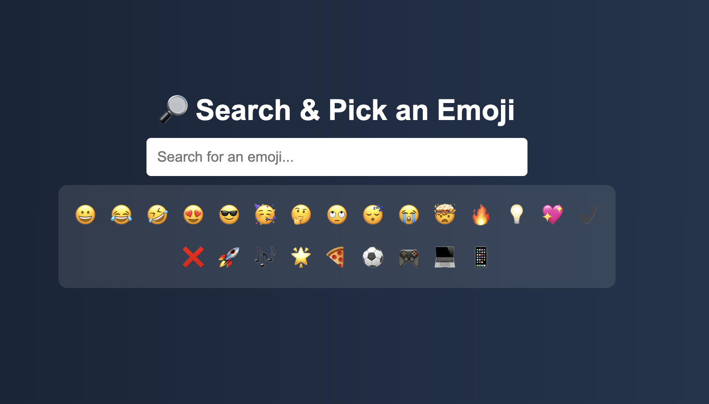

# Day 18 - Emoji Picker with Live Search

## 🚀 Project Overview
Welcome to **Day 18** of my **30-Day Coding Challenge**!  
In this project, I built a **searchable emoji picker** that allows users to **quickly find emojis** by typing keywords. The list **filters live** as you type, making it easy to find the perfect emoji for any mood or message.

---

## ✨ Features
✅ Live search functionality – results update as you type  
✅ Large collection of popular emojis  
✅ Clean and responsive design  
✅ Easy to use – just type and pick!  
✅ Works directly in your browser (no setup required)

---

## 📂 Technologies Used
- **HTML** for structure  
- **CSS** for styling  
- **JavaScript** for interactivity

---

## 📖 How to Use
1. Open the **index.html** file in your browser.
2. Start typing a keyword like **smile**, **heart**, or **cat**.
3. The emoji list will instantly filter to show matching emojis.
4. Click an emoji to **copy it to your clipboard** (optional enhancement for future versions).
---

# Demo page

Click [Here](https://ayshasanyang.github.io/Day-18-Emoji-Picker/) to view the page

## 🚀 How to Run
1. Download or clone the repository
```bash
git clone https://github.com/ayshasanyang/Day-18-Emoji-Picker.git
```
2. Navigate to the project folder.
3. Open the project files in your vscode or any code editor of your choice
4. Open the `index.html` file in your web browser.

---

## 📸 Preview


---
Made with ❤️ by [AYSHA] 🚀